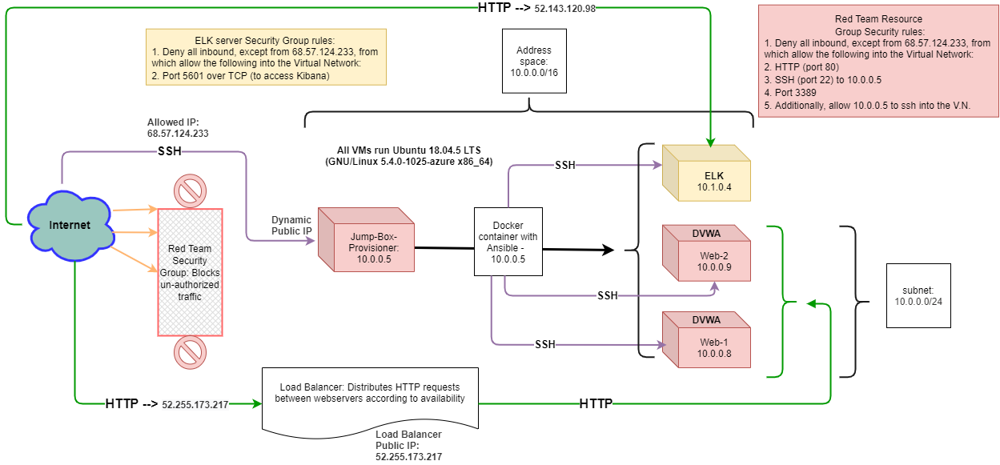
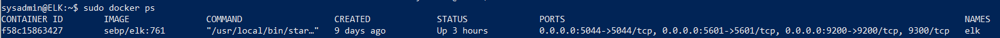

## Automated ELK Stack Deployment

The files in this repository were used to configure the network depicted below.

These files have been tested and used to generate a live ELK deployment on Azure. They can be used to either recreate the entire deployment pictured above. Alternatively, select portions of the elkdocker.yml, filebeat-config.yml, or pentest2.yml file may be used to install only certain pieces of it, such as Filebeat.

This document contains the following details:
- Description of the Topology
- Access Policies
- ELK Configuration
  - Beats in Use
  - Machines Being Monitored
- How to Use the Ansible Build

### Description of the Topology

The main purpose of this network is to expose a load-balanced and monitored instance of DVWA, the D*mn Vulnerable Web Application.

Load balancing ensures that the application will be highly available, while the jump-box restricts access to the network.

Integrating an ELK server allows users to easily monitor the vulnerable VMs for changes to the metrics and system logs.

The configuration details of each machine may be found below.

| Name     | Function  | IP Address | Operating System |
|----------|---------- |------------|------------------|
| Jump-Box | Gateway   | 10.0.0.5   | Linux            |
| Web-1    | Webserver | 10.0.0.8   | Linux            |
| Web-2    | Webserver | 10.0.0.9   | Linux            |
| ELK      | ELK server| 10.1.0.4   | Linux            |

### Access Policies

The machines on the internal network are not exposed to the public Internet. 

Only the Jump-Box machine (10.0.0.5) can accept connections from the Internet. Access to this machine is only allowed from the following IP addresses:
- 68.57.124.233

Machines within the network can only be accessed by 10.0.0.5 .

A summary of the access policies in place can be found in the table below.

| Name     | Publicly Accessible | Allowed IP Addresses |
|----------|---------------------|----------------------|
| Jump-Box |     Yes             | 68.57.124.233        |
| Web-1    |     No              | 10.0.0.5             |
| Web-2    |     No              | 10.0.0.5             |
| ELK      |     No              | 10.0.0.5             |

### Elk Configuration

Ansible was used to automate configuration of the ELK machine. No configuration was performed manually, which is advantageous because it minimizes human error, and allows for additional machines to be created quickly if needed.

The playbook implements the following tasks:
- Install docker.io
- Install python3-pip
- Increase virtual memory
- Force the machine to use more memory
- Download and launch a docker continer which installs the ELK stack.

The following screenshot displays the result of running `docker ps` after successfully configuring the ELK instance.

### Target Machines & Beats
This ELK server is configured to monitor the following machines:
- 10.0.0.8
- 10.0.0.9

We have installed the following Beats on these machines:
- Filebeat

These Beats allow us to collect the following information from each machine:
- Filebeat collects log files from multiple machines, and then forwards them to a centralized location. You can then search on all of your machines' log files in Kibana. For example, if you configure filebeat to monitor 100 machines, you can filter all of those logs by search for strange behavior. 

## Using the Playbook
In order to use the playbooks, you will need to have an Ansible control node already configured. Assuming you have such a control node provisioned: 

### To run the pentest2.yml playbook, in order to set up the DVWA webservers:

SSH into the control node (the Jump-Box in my setup) and follow the steps below:
- Start your ansible container and attach into it
- Copy the pentest2.yml file to /etc/ansible
- Update the /etc/ansible/hosts file to include the private IP addresses of your webservers under a category called "[webservers]" along with the python_interpreter line. For example:
          [webservers]
          10.0.0.8 ansible_python_interpreter=/usr/bin/python3        
          10.0.0.9 ansible_python_interpreter=/usr/bin/python3        
- Run the playbook with `ansible-playbook`, and navigate to http://[the IP address of one of your webservers] to check that the installation of DVWA worked as expected.
 

### To run the elkdocker.yml file, to set up the ELK server:

SSH into the control node and follow the steps below:
- Start your ansible container and attach into it
- Copy the elkdocker.yml file to /etc/ansible
- Update the /etc/ansible/hosts file to include the IP address of your ELK server under a category called "[elkserver]" along with the python_interpreter line. For example:
    [elkserver]                                                                           10.1.0.4 ansible_python_interpreter=/usr/bin/python3           
- Run the playbook with `ansible-playbook`, and navigate to http://[the IP of your ELK machine]:5601/app/kibana to check that the installation worked as expected.